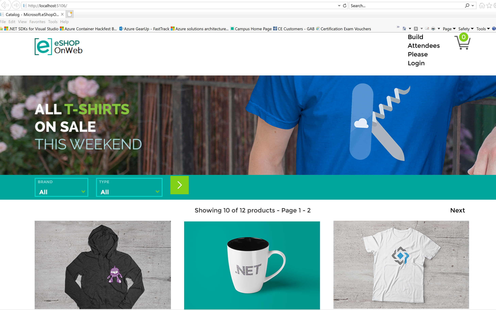
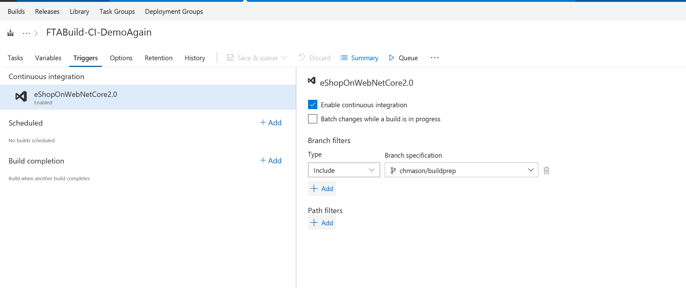

## Modernize .NET Core Application, Build VSTS pipelines, Deploy to AKS Linux Cluster
Cloud Modernization Dry Run Steps
 
## Abstract ##

## Learning Objectives ##
After completing this excerisize you will be able to:

- Containerize the eShopOnWeb E-Commerce Application
- Build and Push container images to Azure Container Registry
- Create Build and Release Definitions in VSTS
- Enable Continuous Integration and Delpoyment in VSTS
- Reference creating a AKS Cluster in Azure
- Deploy the solution using VSTS to AKS Cluster

## Pre-Requisites ##
In order to complete this POC you will need:

- A **Microsoft Azure** subscription with (at least) contributor access
- Install latest version of **Visual Studio 2017 Enterprise** with following Workloads:
	- .NET desktop development
	- ASP.NET and web development
	- Azure development
	- Data storage and processing
- Download latest **SQL Server Management Studio** [here](https://docs.microsoft.com/en-us/sql/ssms/download-sql-server-management-studio-ssms)
- Install the latest version of [Azure CLI](https://docs.microsoft.com/en-us/cli/azure/install-azure-cli?view=azure-cli-latest)
- Download and install the latest **Docker Tools** from [here](https://docs.docker.com/docker-for-windows/install/)
- Download the **eShopOnWeb Project** from [here](https://demowebst.blob.core.windows.net/sharecode/eShopOnWebNetCore2.0.zip)
- Provison and deploy an AKS Cluster in Azure. [Here](https://docs.microsoft.com/en-us/azure/aks/kubernetes-walkthrough-portal) is a reference on creating AKS cluster in Azure
- Run the following command to get the credentials on your machine. These are downloaded to a config file C:\Users\yourusername\.kube\config. You will need the contents of this config file in a later step
```` CLI
az aks get-credentials --resource-group ft-akslinux-rg --name Fezk8sLinuxCluster
````

## Set up the Application Locally 
* Check in the code for eWebShop in in VSTS. You can create a separate branch other than the main branch
* Open eShop solution and walk through a few pieces of code
* Notice that we added the Application Insights Nuget Package
* Notice in Startup.cs ConfigureServices, this is where we add the kubernetes connection
* Create an Azure SQL DB and create two Databases, you can choose Basic Tier for your Databases
  * CatalogDB
  * IdentityDB
* In Visual Sudio Solution, navigate to the appsettings.json file. src\web\appsettings.json
* Replace lines 3 and 4 with the connection string values of your database server, username and password

```` JSON
 "CatalogConnection": "Server=tcp:YOURDBSERVERNAME.database.windows.net,1433;Initial Catalog=CatalogDB;Persist Security Info=False;User ID=YOURUSERID;Password=YOURPASSWORD;MultipleActiveResultSets=False;Encrypt=True;TrustServerCertificate=False;Connection Timeout=30;",
 "IdentityConnection": "Server=tcp:YOURDBSERVERNAME.database.windows.net,1433;Initial Catalog=IdentityDB;Persist Security Info=False;User ID=YOURUSERID;Password=YOURPASSWORD;MultipleActiveResultSets=False;Encrypt=True;TrustServerCertificate=False;Connection Timeout=30;"
````

* Run the application in Visual Studio locally. It will connect to Azure SQL and you can do some shopping on the site.


 
* Create an AppInsights instance, to keep manageable, create it in the same Resource Group as the Managed AKS cluster. Note down the **Instrumentation Key**

* Create an instance of Azure Container Registry in the Azure Portal. You may keep using the same Resource Group. [Here](https://docs.microsoft.com/en-us/azure/container-registry/) is more information on ACR
* Your provisioned AKS cluster will look similar to the one below:

## Set up Build  Definition in VSTS
* Go to VSTS, create a new build
* To set up build steps, you will add two Docker tasks and one for Publish Artifact (docker build, docker push, publish k8s files)
* Your Completed build defintion with three tasks will look like this:

* Create a new build definition, select continue, Empty Process, ensure to use Hosted Linux Preview for Agent Queue
* **Build Image**


* **Push an Image**


* Ensure Use Default Build Context is unchecked and leave the resulting text field blank!!
* Ensure You have your own Subscription selected and Authenticated with that subscription. Enter the rest of the fields as shown, leave rest as is. 

* Enable Continuous Integration under Triggers

 
* Publish Artifact


* **Kick off a build and let it finish**


## Set up Release Definition in VSTS
* Create a release definition and pipeline
  * Setup release steps (token replace, kubectl apply)
  * Use Empty Process
  * 
  * Point to the build definition you created
  * Click on phase and tasks link for Environment
4.	Add two tasks 1) One for Replace Tokens - Search for Token  2) One for kubectl apply - Search for kube, you want the Deploy To Kubernetes Task, name it kubectl apply
5.	For Replace tokens: Change display name: Replace tokens in **/*.yaml **/*.yml
a.	Change Target Files: 
**/*.yaml
**/*.yml
 
b.	Add variables and their respective values
AppInsightsKey
YourValue
 
CatalogConnection
YourValue
 
IdentityConnection
YourValue
 
ImageNumber
YourValue
 
REPOSITORY
YourValue
 
 
c.	Setup CD trigger
d.	Deploy
 
3.	Hopefully this will work 
4.	Once the app is deployed click around a bit, collect some telemetry
5.	Go to app insights and configure 2 chart metrics (server requests and server response time: group by cloud role instance)
6.	Make a change in the code (e.g. change “Login” to “Sign in” or something visible)
7.	Commit and push.
8.	Come back in about 5 minutes and it should be done.
 
 
 
********************************************************************************************
##  Application Insights set up
 
Once created, go to the Metrics Explorer
I have two created.
1.	demoAIfork8s - Instrumentation Key: efb0597c-3ffd-4e2f-9c41-82a94b41bb05
2.	demoAIbuild2018fork8s - Instrumentation Key: 4aaa7d66-9dae-4901-b9f9-e57916b2b2f9
 
1.	Graph One, Click on Edit. 
a.	Grouping on
b.	Group by: Cloud Role Instance
c.	Server, select Server Requests
 
2.	Graph Two
a.	Grouping on
b.	Group by: Cloud Role Instance
c.	Server, select Server Response Time
 
3.	Display Three:
a.	Chart Type, Grid
b.	Cloud role instance
c.	Usage: Check Sessions
 
Click and add items to the basket and do some shopping. Telemetry Data will start flowing into the portal from k8s cluster!
Endpoint: Fasialk8sConnection

•	This is where you set up connection to k8s cluster using the cluster config that you download by executing the get credentials command ffrom Azure Portal.
•	Click New for new connection
•	After running the get-credentials command, Your config file is located: C:\Users\faisalm\.kube
•	Copy the contents in the KubeConfig field when setting up the new connection


##  See the CI/CD Kick off a Build and Release
* Make a change in the code (e.g. change “Login” to “Sign in” or something visible)
* Commit and push.
* A build would be kicked-off/completed, the release will push the new build, and updated code is deplyed to the k8s cluster. This will take about 5 minutes.
